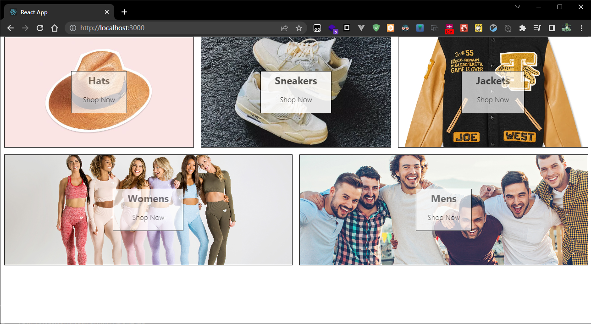

当前目录结构：
```bash
jayce@jayce123:src$ pwd
/mnt/e/Users/jayce/Desktop/laboratory/learn-react/UdemyCourse/code/crwn-clothing/src
jayce@jayce123:src$ tree
.
├── App.css
├── App.js
├── App.test.js
├── components
│   ├── category-item
│   │   ├── category-item.component.jsx
│   │   └── category-item.styles.scss
│   └── directory
│       ├── directory.component.jsx
│       └── directory.styles.scss
├── index.css
├── index.js
├── logo.svg
├── reportWebVitals.js
└── setupTests.js

3 directories, 12 files
```

页面如下：
