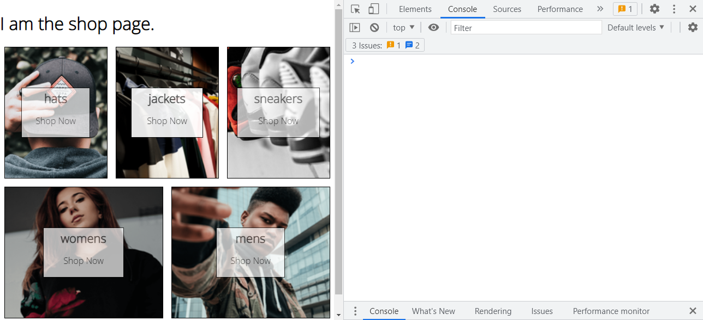

**src/App.js**

```diff
+ import { Routes, Route } from "react-router-dom";
import Home from "./routes/home/home.component";

function App() {
  return (
    <Routes>
+      <Route path='/' element={<Home />} />
    </Routes>
  );
}

export default App;

```


**嵌套路由示例**

```jsx
import { Routes, Route } from "react-router-dom";
import Home from "./routes/home/home.component";

const Shop = () => {
  return <h1>I am the shop page.</h1>;
};

function App() {
  return (
    <Routes>
      {/* <Route path='/' element={<Home />}/> */}
      <Route path='/home' element={<Home />}>
        <Route path='shop' element={<Shop />} />
      </Route>
    </Routes>
  );
}

export default App;
```

仅这样是不够的， 嵌套路由需要指定嵌套的组件视图在父祖家中的渲染区域：

因此需要在父组件中指定：

**src/routes/home/home.component.jsx**

 ```diff
 import Directory from "../../components/directory/directory.component";
 + import { Outlet } from "react-router-dom";
 function Home() {
 -  return <Directory />;
 +  return (
 +    <div>
 +      <Outlet />
 +      <Directory />;
 +    </div>
 +  );
 }
 
 export default Home;
 ```

