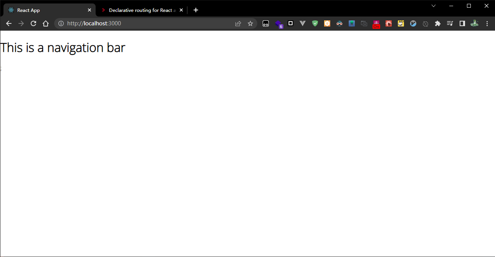
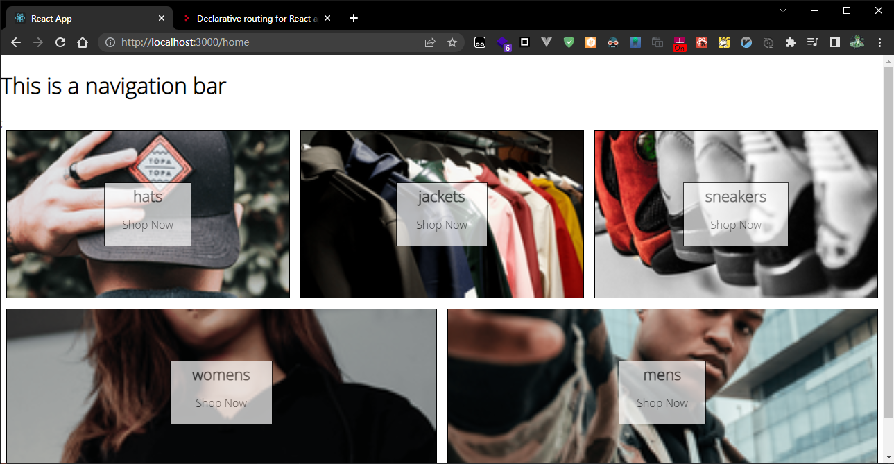
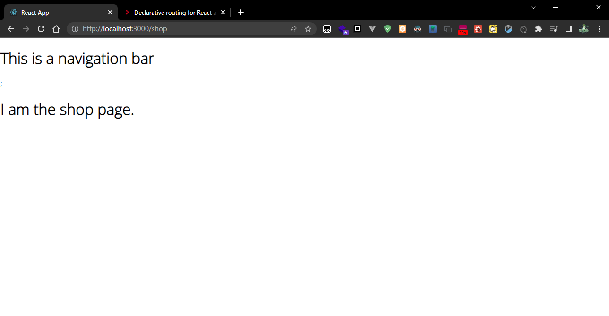
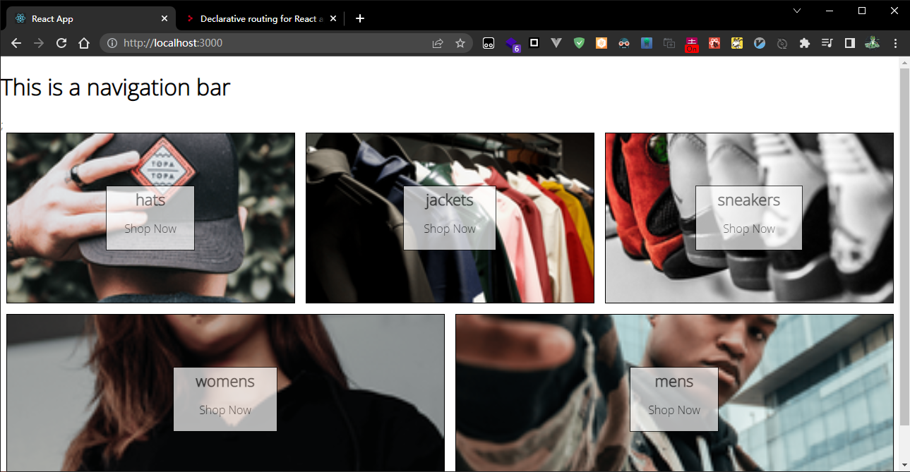

**src/App.js**

```jsx
import { Routes, Route, Outlet } from 'react-router-dom';
import Home from './routes/home/home.component';

const Shop = () => {
  return <h1>I am the shop page.</h1>;
};
const Navigation = () => {
  return (
    <div>
      <h1>This is a navigation bar</h1>;
      <Outlet />
    </div>
  );
};
function App() {
  return (
    <div>
      <Routes>
        <Route path="/" element={<Navigation />}>
          <Route path="/home" element={<Home />} />
          <Route path="/shop" element={<Shop />} />
        </Route>
      </Routes>
    </div>
  );
}

export default App;
```

> 如何比较快速的理解这个路由的使用 ？
>
> 有几个点着重留意一下：
>
> 1. 嵌套路由，有父级组件和子级组件；
>
> 2. 父级组件中，需要指定子级组件的展示空间（路由出口），我们用 `<Outlet/>` 来指定。 
>
> 3. 如何组织 Routes ?
>
>    将子级组件包裹起来，就像 vue 中的 “slot” 一样

现在的页面可以如下展示：







显然， 我们希望 "/home" 为默认的子路由渲染页，而不是需要手动指定 "/home", 这时候我们可以给 `<Home/>` 组件，传入一个 属性 `{index: true}`, 来告诉 React router 这是我们需要默认展示的子路由：

```diff
import { Routes, Route, Outlet } from 'react-router-dom';
import Home from './routes/home/home.component';

const Shop = () => {
  return <h1>I am the shop page.</h1>;
};
const Navigation = () => {
  return (
    <div>
      <h1>This is a navigation bar</h1>;
      <Outlet />
    </div>
  );
};
function App() {
  return (
    <div>
      <Routes>
        <Route path="/" element={<Navigation />}>
-          <Route index element={<Home />} />
+          <Route path="/home" element={<Home />} />
          <Route path="/shop" element={<Shop />} />
        </Route>
      </Routes>
    </div>
  );
}
export default App;
```

现在我们可以仅通过 "/" 就能看到 之前的 “/home” 了。



> @jayce,之前的 home 组件中的 `Outlet` 只是示例用的，用不着暂时去掉了。
>
> ```diff
> import Directory from "../../components/directory/directory.component";
> - import { Outlet } from "react-router-dom";
> function Home() {
>   // return <Directory />;
>   return (
>     <div>
>       <Directory />;
> -      <Outlet />
>     </div>
>   );
> }
> 
> export default Home;
> ```


导航栏组件化

```bash
$ mkdir src/routes/navigation
$ touch src/routes/navigation/navigation.component.jsx
```

**navigation.component.jsx**

```jsx
import { Outlet } from 'react-router-dom';
import { Fragment } from 'react';
const Navigation = () => {
  return (
    <Fragment>
      <h1>This is a navigation bar</h1>;
      <Outlet />
    </Fragment>
  );
};

export default Navigation;
```

> `<Fragment>` 类似 Vue 中的 `<Template>` , 他用于包裹元素，但是不渲染实际的 Dom 元素。

**App.js**

```jsx
import { Routes, Route, Outlet } from 'react-router-dom';
import Home from './routes/home/home.component';
import Navigation from './routes/navigation/navigation.component.jsx';
const Shop = () => {
  return <h1>I am the shop page.</h1>;
};

function App() {
  return (
    <div>
      <Routes>
        <Route path="/" element={<Navigation />}>
          <Route index element={<Home />} />
          <Route path="/shop" element={<Shop />} />
        </Route>
      </Routes>
    </div>
  );
}

export default App;
```

**navigation.component.jsx**

```jsx
import { Outlet, Link } from 'react-router-dom';
import { Fragment } from 'react';
import { ReactComponent as CrwnLogo } from '../../assets/crown.svg';
import './navigation.styles.scss';
const Navigation = () => {
  return (
    <Fragment>
      <div className="navigation">
        <Link className="logo-container" to="/">
          <CrwnLogo className="logo" />
        </Link>
        <div className="nav-links-container">
          <Link className="nav-link" to="/shop">
            Shop
          </Link>
        </div>
      </div>
      <Outlet />
    </Fragment>
  );
};

export default Navigation;
```

> Link 是路由跳转控件，类似 Vue 中的 `<Route-link>`


当前目录结构：

```bash
jayce@jayce123:src$  tree
.
├── App.css
├── App.js
├── App.test.js
├── assets
│   └── crown.svg
├── components
│   ├── category-item
│   │   ├── category-item.component.jsx
│   │   └── category-item.styles.scss
│   └── directory
│       ├── directory.component.jsx
│       └── directory.styles.scss
├── index.js
├── index.scss
├── logo.svg
├── reportWebVitals.js
├── routes
│   ├── home
│   │   └── home.component.jsx
│   └── navigation
│       ├── navigation.component.jsx
│       └── navigation.styles.scss
└── setupTests.js

7 directories, 16 files
```

