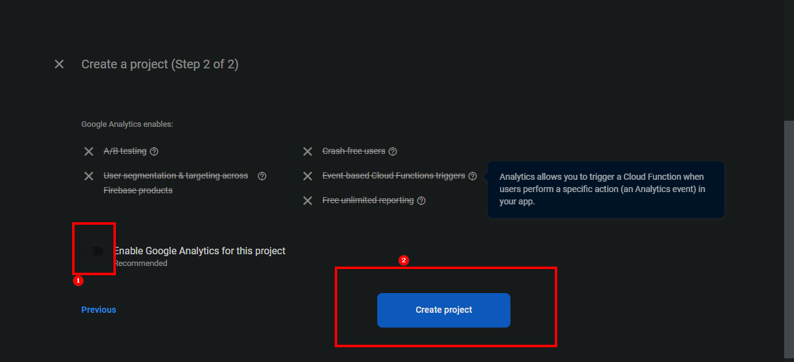

https://firebase.google.com/

Firebase 是一个 Google 平台，可以让你启动数据库。  它实际上是一套非常全面的托管工具，但是主要用途是它帮助我们利用某种数据库。





项目引入firebase 依赖：
```bash
$ yarn add firebase
```


创建SignIn 导航组件

```bash
$ mkdir src/routes/sign-in
$ touch sign-in.component.jsx
```

**src/App.js**

```jsx
import { Routes, Route, Outlet } from "react-router-dom";
import Home from "./routes/home/home.component";
import Navigation from "./routes/navigation/navigation.component.jsx";
import SignIn from "./routes/sign-in/sign-in.component.jsx";
const Shop = () => {
  return <h1>I am the shop page.</h1>;
};

function App() {
  return (
    <div>
      <Routes>
        <Route path='/' element={<Navigation />}>
          <Route index element={<Home />} />
          <Route path='/shop' element={<Shop />} />
          <Route path='sign-in' element={<SignIn />} />
        </Route>
      </Routes>
    </div>
  );
}
export default App;
```

**src/routes/sign-in/sign-in.component.jsx**

```jsx
const SignIn = () => {
  return (
    <div>
      <h1> Sign In Page</h1>
    </div>
  );
};
export default SignIn;
```


