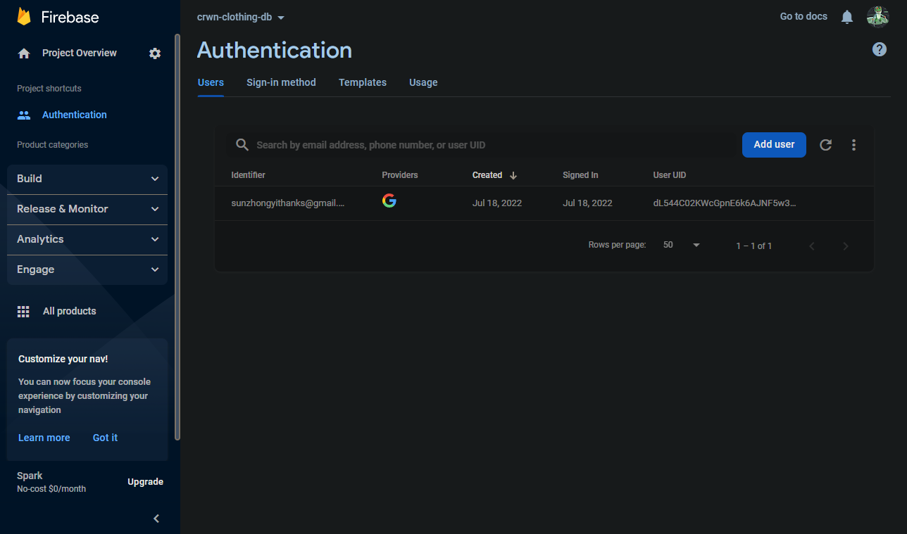
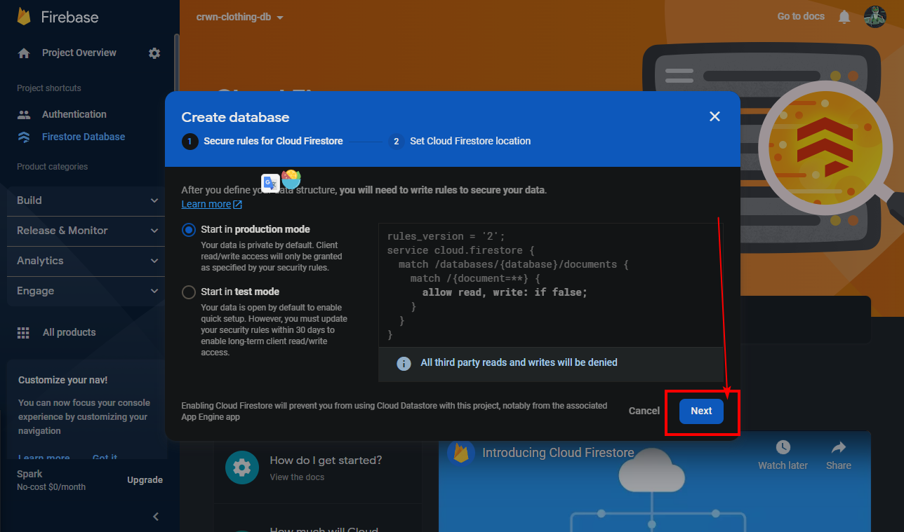
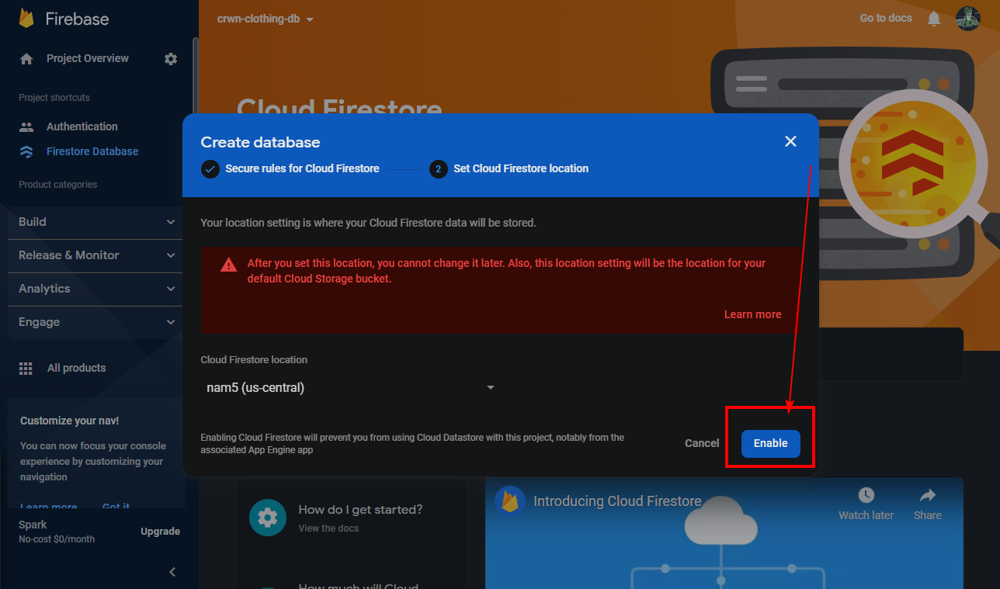
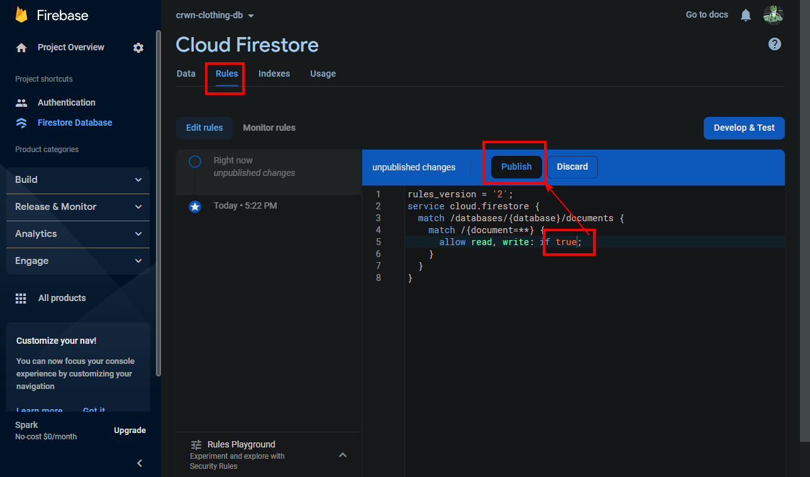

在上节中，我们引入了 firebase 的谷歌授权登录部分，现在查看：

可以看到测试登录的时候会在这里记录用户列表。 

但是 firebase 数据库 中还没有数据。这些用户不一定是你的 Fire Store 数据库中可访问的用户。firebase提供的身份验证服务和 fire store 数据库服务是分开的。 Fire Store 是我们将要在 Firebase 内部使用的实际数据库。

为了了解firebase 数据库的使用，这里先简单介绍一下：

Fire Store 类似一个 “schemeless（#无模式）” 数据库，即它几乎是一个 JSON 对象。

FireStore 由三个部分组成，data, collection.document 

> So you can imagine that if we had a collection of users, we would make a separate folder with users on it, so that we know that inside of that folder, it's all of out data related to every instance of user that is inside of our database. Each separate document represents a individual piece of data, so an independent user。
>
> 就是假设想象一群用户作为一个 collection, 那么 document 就代表了每一个单独的 用户。data 就是这个用户单独的数据对象。

**创建 FireStore**

 

> 这里的配置，定义了规则： 允许谁修改此处的哪些 documents 

现在有了这些设置，我们是继善更可以开始在我们的内部实现存储用户了。