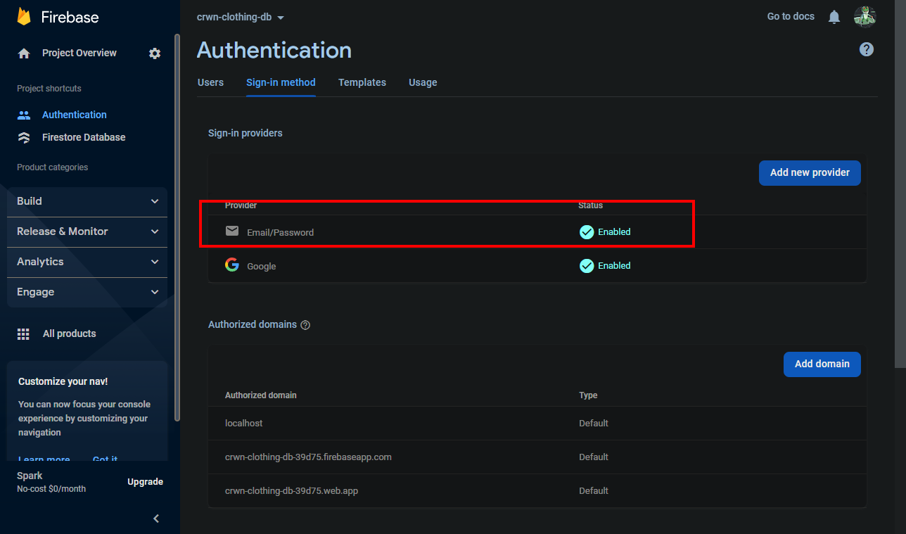

 firebase 除了支持三方平台登录，还支持 邮箱密码， 这需要先启用一个允许我们提供电子邮件的提供商 



**前端构建登录组件**

```bash
$ mkdir src/components/sign-up-form
$ touch src/components/sign-up-form/sign-up-form.component.jsx
$ touch src/components/sign-up-form/sign-up-form.styles.scss
```

**sign-up-form.component.jsx**

 ```jsx
 import { useState } from "react";
 const defaultFormFields = {
   displayName: "",
   email: "",
   password: "",
   comfirmPassword: "",
 };
 const SignUpForm = () => {
   const [formFields, setFormFields] = useState(defaultFormFields);
   const { displayName, email, password, comfirmPassword } = formFields;
   const handleChange = (event) => {
     console.log(event.target.value);
     const { name, value } = event.target;
     setFormFields({ ...formFields, [name]: value });
   };
   return (
     <div>
       <h1>Sign up with your email and password</h1>
       <form onSubmit={() => {}}>
         <label>Display Name</label>
         <input
           required
           type='text'
           onChange={handleChange}
           name='displayName'
           value={displayName}
         />
         <label>Email</label>
         <input
           required
           type='email'
           onChange={handleChange}
           name='email'
           value={email}
         />
         <label>Password</label>
         <input
           required
           type='password'
           onChange={handleChange}
           name='password'
           value={password}
         />
         <label>Comfirm Password</label>
         <input
           required
           type='password'
           onChange={handleChange}
           name='comfirmPassword'
           value={comfirmPassword}
         />
         <button type='submit'>Sign Up</button>
       </form>
     </div>
   );
 };
 export default SignUpForm;
 ```

对于邮箱密码登录，我们需要`displayName` ， `email`， 但是我们并不像将 `password` 存储在我们的数据库中，因为这是敏感信息。我们将利用 Firebase 身份验证，它会帮我们确定用户和密码是否匹配。这样，即使 fire store 被黑客入侵了，我们的密码也不会泄露。 所以这也是 firestore 的一个很棒的功能。

 **src/utils/firebase/firebase.utils.js**

```diff
import { initializeApp } from "firebase/app";
import {
  getAuth,
  signInWithRedirect,
  signInWithPopup,
  GoogleAuthProvider, // 如果要使用其他的平台登录，还可以使用facebook等，这时需要引入对应的provider
+  createUserWithEmailAndPassword,
} from "firebase/auth";

...
...
...
export const createUserDocumentFromAuth = async (userAuth) => {
  // 从身份验证服务器获取access_token, 然后将其存储在FireStore中
  /**
   * 1. if user data exist, return userDocRef
   * 2. if user data does not exist,  set the document with the data from userAuth im my collection
   */
+  if (userAuth) return;
  const userDocRef = doc(db, "user", userAuth.uid);
  const userSnapshot = await getDoc(userDocRef);
  ...
  ...
  }
  
+ export const createAuthUserWithEmailAndPassword = async (email, password) => {
+   if (!email || !password) return;
+   createUserWithEmailAndPassword(auth, email, password);
+ };
```

**src/components/sign-up-form/sign-up-form.component.jsx**

```jsx
import { useState } from "react";
import { createAuthUserWithEmailAndPassword } from "../../utils/firebase/firebase.utils";
const defaultFormFields = {
  displayName: "",
  email: "",
  password: "",
  confirmPassword: "",
};
const SignUpForm = () => {
  const [formFields, setFormFields] = useState(defaultFormFields);
  const { displayName, email, password, confirmPassword } = formFields;
  const handleChange = (event) => {
    console.log(event.target.value);
    const { name, value } = event.target;
    setFormFields({ ...formFields, [name]: value });
  };
  const handleSubmit = async (event) => {
    event.preventDefault();
    if (password !== confirmPassword) {
      alert("Passwords do not match");
      return;
    }

    try {
      const res = await createAuthUserWithEmailAndPassword(email, password);
      console.log(res);
    } catch (error) {
      console.log("user creation encountered an error: ", error);
    }
  };
  return (
    <div>
      <h1>Sign up with your email and password</h1>
      <form onSubmit={handleSubmit}>
        <label>Display Name</label>
        <input
          required
          type='text'
          onChange={handleChange}
          name='displayName'
          value={displayName}
        />
        <label>Email</label>
        <input
          required
          type='email'
          onChange={handleChange}
          name='email'
          value={email}
        />
        <label>Password</label>
        <input
          required
          type='password'
          onChange={handleChange}
          name='password'
          value={password}
        />
        <label>Comfirm Password</label>
        <input
          required
          type='password'
          onChange={handleChange}
          name='confirmPassword'
          value={confirmPassword}
        />
        <button type='submit'>Sign Up</button>
      </form>
    </div>
  );
};
export default SignUpForm;
```

<video src="common.assets/2022-07-19 11-07-53.mp4"></video>

**组件化以及样式**

```bash
$ mkdir src/components/form-input
$ touch src/components/form-input/form-input.component.jsx
```

**form-input.component.jsx**

```jsx
import "./form-input.styles.scss";
const FormInput = ({ label, ...otherProps }) => {
  return (
    <div className='group'>
      {label && (
        <label
          className={`${
            otherProps.value.length ? "shrink" : ""
          } form-input-label`}
        >
          {label}
        </label>
      )}
      <input className='form-input' {...otherProps} />
    </div>
  );
};

export default FormInput;

```

**src/components/sign-up-form/sign-up-form.component.jsx**

```jsx
import { useState } from "react";
import FormInput from "../form-input/form-input.component";
import { createAuthUserWithEmailAndPassword } from "../../utils/firebase/firebase.utils";
const defaultFormFields = {
  displayName: "",
  email: "",
  password: "",
  confirmPassword: "",
};
const SignUpForm = () => {
  const [formFields, setFormFields] = useState(defaultFormFields);
  const { displayName, email, password, confirmPassword } = formFields;
  const handleChange = (event) => {
    console.log(event.target.value);
    const { name, value } = event.target;
    setFormFields({ ...formFields, [name]: value });
  };
  const handleSubmit = async (event) => {
    event.preventDefault();
    if (password !== confirmPassword) {
      alert("Passwords do not match");
      return;
    }

    try {
      const res = await createAuthUserWithEmailAndPassword(email, password);
      console.log(res);
    } catch (error) {
      console.log("user creation encountered an error: ", error);
    }
  };
  return (
    <div>
      <h1>Sign up with your email and password</h1>
      <form onSubmit={handleSubmit}>
        <FormInput
          label={"Display Name"}
          required
          type='text'
          onChange={handleChange}
          name='displayName'
          value={displayName}
        />
        <FormInput
          label={"Email"}
          required
          type='email'
          onChange={handleChange}
          name='email'
          value={email}
        />
        <FormInput
          label={"Password"}
          required
          type='password'
          onChange={handleChange}
          name='password'
          value={password}
        />
        <FormInput
          label={"Comfirm Password"}
          required
          type='password'
          onChange={handleChange}
          name='confirmPassword'
          value={confirmPassword}
        />

        <button type='submit'>Sign Up</button>
      </form>
    </div>
  );
};
export default SignUpForm;

```

scss 文件

```bash
$ cd src/components/form-input
$ wget https://github.com/ZhangMYihua/crwn-clothing-v2/raw/lesson-11/src/components/form-input/form-input.styles.scss
```

