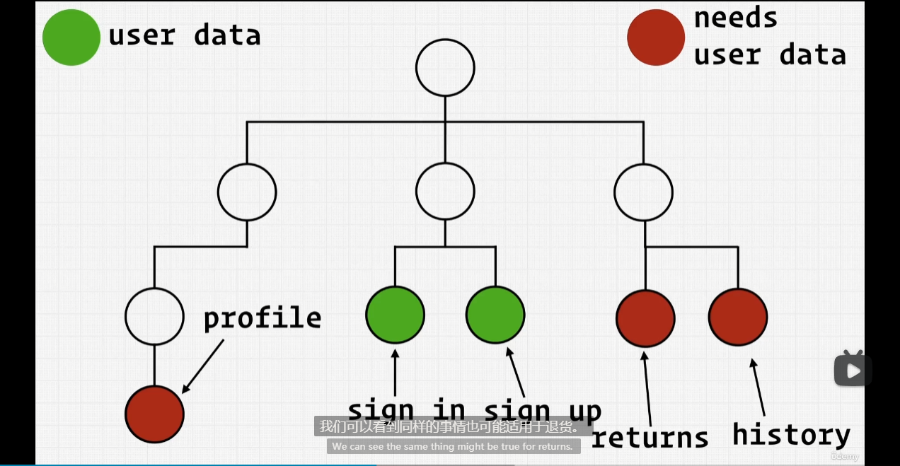

**回顾**

这个课程中，花了大量的时间去引入 firebase 平台，大量的时间用于在写 `authentication` 这个组件。（p087~p101）.

总结的来说， Firebase 是一个托管平台，内部有很多服务，我们这个demo项目中， 用到了 认证登录， 以及数据库。 

在前面的课程中，主要是在着重开发 认证登录的逻辑。 

我们支持了 

- 邮箱 + 密码 注册
- 邮箱 + 密码 登录
- 谷歌认证登录

如果愿意，我们还可以利用 Firebase 开放的其他 三方平台的 provider 以轻松实现 例如 facebook，GitHub 等的登录

我们利用了 firestore 这个数据库，firestore 提供了前端的操作sdk， 使得我们不需要开发后台，可以直接在前台操作 CRUD request 进行数据库的操作， 但是目前位置我们所做的操作还比较单一。 

仅在用 Google 三方登录时，如果没有记录用户，那么就创建该用户时，将该用户写入到数据库。


而 firebase authentication 则不论时用 Google 三方登录，还是邮箱密码登录都会被记录下来。 


后面的相关课程中，将会继续与用户登录相关的操作。 


到目前为止，谷歌三方登录，以及邮箱密码登录，都会返回一个用户对象， 我们没有对它们做任何处理：

**src/components/sign-in-form/sign-in-form.component.jsx**


所以为了让我们更好的理解我们想要对我们获得的这个用户对象 做什么

假设有这样一个页面架构：


可以想到，settings 和 orders 都是需要用到用户对象的。所以这里的关键是，根据我们目前位置的构建，我们知道，用户对象，我们要么在登录中获得，或者在注册的时候获得。


这里是我们直接从 Firebase 获得实际的用户认证对象的地方（#user auth object）



settings 中的用户资料，以及orders 中的订单退货，历史等信息，都是关联用户的。 所以这两个部分都是需要用户信息的。


**所以，我们应该如何管理这个用户对象数据呢？**

我们要做的，是我们必须弄清楚这些组件中的哪个是顶级的，可以从顶层将数据分发到各个子级组件。 


那么就有两种方式可以做到：

1. 从最高层级获取数据，然后传递到子级组件；（通过 props）
2. 从子级组件获取到数据，然后回传给顶层父级组件，然后由父级去分发数据。(回调子传父，然后props 父传子)

>  不能直接将用户信息传递到 个人资料 或者 订单中（横向传递）, 

以上两种方式都是很麻烦的，但是可以做到。


不仅很麻烦，而且，很多节点除了去处理数据的传递，根本没有利用数据的必要。 

为了解决上述的问题，React 提供了一些方法，


总的思想，如上图所示，例如我们登录后获取用户数据，然后把他存储到一个单独的空间，然后任何组件需要用到这个空间的数据，直接去取就好了。 这样就可以极大的简化我们的数据管理。 


**Context**

Context 上下文， 非常 **类似于一个包含所有其他需要访问的组件的组件**（# It's very similar to a component that wraps around all of your other components that need access to）, 这个上下文，你可以看作是一个存储位置。

> 和 Vue 中的 Store 概念是类似的

```bash
$ mkdir src/context
$ touch src/context/user.context.jsx
```


**src/index.js**

```jsx
import React from "react";
import ReactDOM from "react-dom/client";
import { BrowserRouter } from "react-router-dom";

import "./index.scss";
import App from "./App";
import { UserProvider } from "./context/user.context";

import reportWebVitals from "./reportWebVitals";

const root = ReactDOM.createRoot(document.getElementById("root"));
root.render(
  <React.StrictMode>
    <BrowserRouter>
      <UserProvider>
        <App />
      </UserProvider>
    </BrowserRouter>
  </React.StrictMode>,
);

// If you want to start measuring performance in your app, pass a function
// to log results (for example: reportWebVitals(console.log))
// or send to an analytics endpoint. Learn more: https://bit.ly/CRA-vitals
reportWebVitals();
```

> 任何被 `<UserProvider>` 所包裹的组件，包括内部的嵌套组件，都可以访问到上下文（Context）。

**src/components/sign-in-form/sign-in-form.component.jsx**

```diff
+ import { useState,useContext } from "react";
+ import { UserContext } from "../../context/user.context";
- import { useState } from "react";
import FormInput from "../form-input/form-input.component";
import Button from "../button/button.component";
import {
  signInWithGooglePopup,
  createUserDocumentFromAuth,
  signInAuthUserWithEmailAndPassword,
} from "../../utils/firebase/firebase.utils";
import "./sign-in-form.styles.scss";
const defaultFormFields = {
  email: "",
  password: "",
};
const SignInForm = () => {
  const [formFields, setFormFields] = useState(defaultFormFields);
  const { email, password } = formFields;
+ const { setCurrentUser } = useContext(UserContext)
  const handleChange = (event) => {
    const { name, value } = event.target;
    setFormFields({ ...formFields, [name]: value });
  };
  const resetFormFields = () => {
    setFormFields(defaultFormFields);
  };
  const handleSubmit = async (event) => {
    event.preventDefault();
    try {
+     const { user } = await signInAuthUserWithEmailAndPassword(email, password);
-     await signInAuthUserWithEmailAndPassword(email, password);
+     setCurrentUser(user)
      resetFormFields();
    } catch (error) {
      switch (error.code) {
        case "auth/wrong-password":
          alert("incorrect password for email");
          break;
        case "auth/user-not-found":
          alert("no user associated with this email");
          break;
        default:
          console.log("user creation encountered an error: ", error);
      }
    }
  };
  const signInWithGoogle = async () => {
    const { user } = await signInWithGooglePopup();
    await createUserDocumentFromAuth(user);
  };
  return (
    <div className='sign-up-container'>
      <h2>Have an account ?</h2>
      <span>Sign up with your email and password</span>
      <form onSubmit={handleSubmit}>
        <FormInput
          label={"Email"}
          required
          type='email'
          onChange={handleChange}
          name='email'
          value={email}
        />
        <FormInput
          label={"Password"}
          required
          type='password'
          onChange={handleChange}
          name='password'
          value={password}
        />
        <div className='buttons-container'>
          <Button type='submit'>Sign In</Button>
          <Button type='button' onClick={signInWithGoogle} buttonType='google'>
            Google Sign In
          </Button>
        </div>
      </form>
    </div>
  );
};
export default SignInForm;
```

